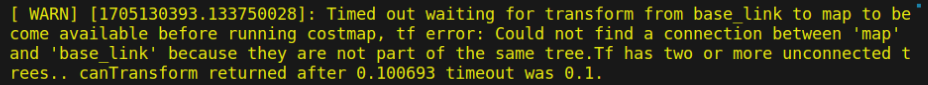

# RK-3566配置pibot_ros

### 一、需要安装的库

​		将RK3588上`pibot_ros/ros_ws`文件夹复制后删去 `devel` 和 `build` 目录编译前先安装

### 全覆盖需要的库如下：

```shell
sudo apt install ros-noetic-opengm
sudo apt install ros-noetic-libdlib
sudo apt install ros-noetic-cob-map-accessibility-analysis
sudo apt-get install coinor-*
```

​		安装完成后在`ros_ws`目录下catkin_make,编译成功后即可运行。

```shell
# 启动服务端
roslaunch ipa_room_exploration room_exploration_action_server.launch
# 启动客户端：
roslaunch ipa_room_exploration room_exploration_client.launch
```


### 二、遇到的问题

#### 2.1 连接不上主板 `ls /dev/pibot :No such file` 

- RK3566不支持`CH340`串口模块，推荐使用`CH343、FT232、CP2102` 串口模块
- 改完串口模块后仍然找不到`/dev/pibot`:需要将`ttyUSB0`软链接到`/pibot`上`sudo ln -s /dev/ttyUSB0 /dev/pibot`

#### 2.2 不能键盘控制小车

- 安装键盘控制包：`sudo apt-get install ros-noetic-teleop-twist-keyboard`
- 安装python ：`sudo apt install -y python3`
1. **`/usr/bin/env`: ‘python’: No such file or directory**
- 为其创建符号链接：`sudo ln -s /usr/bin/python3 /usr/bin/python`
1. 每次开机都需要重新建立软链接
- 指定`udev`规则：
`lsusb`:查看设备的`idV`和`idP后`
- 在.rules文件（规则文件）添加规则：

```cpp
SUBSYSTEM=="usb", ATTRS{idVendor}=="your_vendor_id", ATTRS{idProduct}=="your_product_id", SYMLINK+="pibot"
```

- 重新加载`udev`规则

```cpp
sudo udevadm control --reload-rules
sudo service udev restart
```

3566驱动小车底板发生问题：



解决：安装 `sudo apt-get install ros-noetic-robot-ekf`