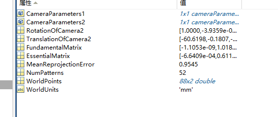

# 双目标定

使用matlab对双目图像进行标定

1. 拍摄双目图像然后将左右目图像进行分割。拍摄和分割均在`catpture_photo.py`完成。完成后图片自动保存在文件夹中。
2. 打开matlab


点击New Session后Add Images分别添加左右目图像。

点击Calibrate进行标定

1. 标定完成后Export Camera Parameters
2. 获得标定结果



```cpp

new_stereo:

Mat cam_matrix_left = (Mat_<double>(3, 3) << 
 4.869084743604942e+02, 0, 0,
        0,4.859921620798602e+02, 0,
      2.813183643903652e+02, 2.267657091677993e+02, 1);
    Mat cam_matrix_right = (Mat_<double>(3, 3) << 
     4.859133331805883e+02, 0, 0,
        0,4.850356748771951e+02, 0,
       2.970046483040089e+02, 2.324763397214774e+02, 1);
    Mat distortion_l = (Mat_<double>(1, 5) <<0.121235284781974,-0.161097849662596, 0,
        0, 0);

    Mat distortion_r = (Mat_<double>(1, 5) <<0.105479235005840,-0.120347246815955, 0,
        0, 0);
    Mat rotate = (Mat_<double>(3, 3) << 
     0.999921984818601, 3.753847738839353e-04, -0.012485325894835,
       -4.085449515452996e-04, 0.999996396040715, -0.002653487630467,
       0.012484284819374, 0.002658381435011,0.999918534502034);
    Mat trans = (Mat_<double>(3, 1) << 
       -60.319997608188590, -0.019664800882533, -0.638993708428792);
```

old stereo

```jsx
Mat cam_matrix_left = (Mat_<double>(3, 3) << 
4.809895643547006e+02, 0, 0,
        0,4.807599168204821e+02, 0,
     3.362108165786334e+02, 2.298502481932070e+02, 1);
    Mat cam_matrix_right = (Mat_<double>(3, 3) << 
     4.903260126250775e+02, 0, 0,
        0,4.900310486342847e+02, 0,
      3.230124997386542e+02, 2.346297967642670e+02, 1);
    Mat distortion_l = (Mat_<double>(1, 5) <<0.113688825569154,-0.106166584327678, 0,
        0, 0);

    Mat distortion_r = (Mat_<double>(1, 5) <<0.121425307936153,-0.141892782717707, 0,
        0, 0);
    Mat rotate = (Mat_<double>(3, 3) << 
    0.999996295879846, 8.723884080433472e-04, 0.002578209660240,
      -8.682590894537506e-04,0.999998339366207, -0.001602308016931,
      -0.002579603213718,0.001600063527818,0.999995392711370);
    Mat trans = (Mat_<double>(3, 1) << 
       -60.348359844102470,-0.030699794141365, 0.495248628081046);
```

注意：拍摄和分割程序在windows下完成，在linux下拍摄，标定结果精度不高。